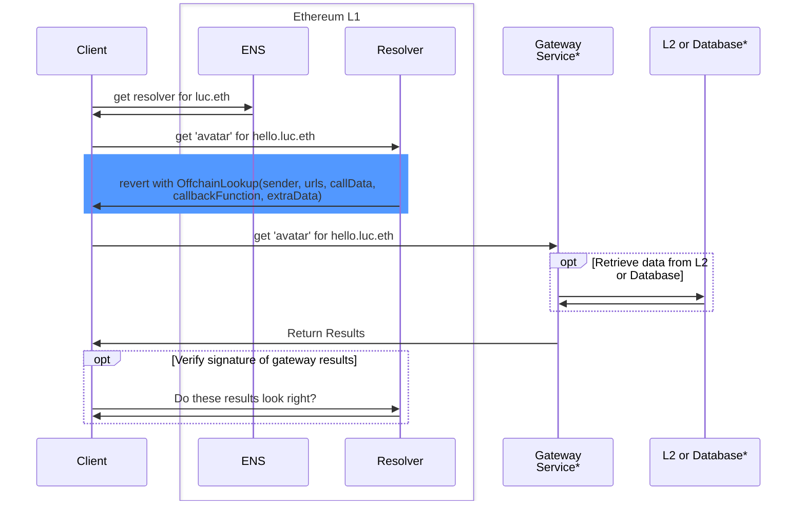

import { WIP } from '@/components/wip/WIP';

{/** @type {import('@/lib/mdxPageProps').MdxMetaProps} */}
export const meta = {
    title: 'Cross Chain Interoperability Protocol (CCIP)',
    description: '',
    emoji: '⛓️',
    contributors: ['lucemans']
};

# Cross Chain / Offchain Names

<WIP />

{/* This document covers what it takes to write a gateway resolver. */}

The source of truth for a name and its subdomains does not always have to be on-chain or on Ethereum L1 at all.
By leveraging [EIP-3668](https://eips.ethereum.org/EIPS/eip-3668), the Cross Chain Interoperability Protocol (CCIP for short), we can load information about a name (and its subnames) by hitting a so called "Gateway".
This enables for storing names, addresses, records, and more on other chains, or even off-chain.

## How does it work?

The Cross Chain Interoperability Protocol (CCIP), is a client-side implemented protocol that introduces the [OffchainLookup](https://eips.ethereum.org/EIPS/eip-3668#contract-interface) error.
Once the client encounters this error, it will attempt to handle it by calling a gateway url. Most Ethereum libraries handle this for you, at no additional cost.

```c
error OffchainLookup(
    address sender, string[] urls,
    bytes callData,
    bytes4 callbackFunction,
    bytes extraData
)
```

## Demo

An example of CCIP in action can be found at [offchain.ens.gregskril.com](https://offchain.ens.gregskril.com/).
This example application allows you to claim a subname for 24 hours.
The name [offchaindemo.eth](https://ens.app/offchaindemo.eth) with resolver [0xDB3...4D27](https://etherscan.io/address/0xDB34Da70Cfd694190742E94B7f17769Bc3d84D27#code), reverts with [OffchainLookup](https://eips.ethereum.org/eips/3668) and directs the client to a gateway url.
The [gateway url](https://ens-gateway.gregskril.workers.dev/lookup/{sender}/{data}.json) returns the information and loads it from a temporary database.

## Steps

To build using CCIP there are two steps:

- [Write an offchain gateway](#writing-a-gateway)
  - (Optional) Loading data from a layer 2 or database
  - (Optional) Verifying the data on-chain
- [Point your name to the gateway](#set)

## Writing a Gateway

To write a gateway

### Template Repositories
<Repository src="ensdomains/offchain-resolver" description="CCIP Offchain ENS Resolver Cloudflare Workers"/>
<Repository src="ensdomains/offchain-resolver-example" />
<Repository src="gskril/ens-offchain-resolver-read-from-api" />

### Loading data from a layer 2 or database

### Verifying the data on-chain (optional)

## Configuring Name {{ navtitle: 'Setting Resolver', id: 'set' }}

Last but not least you need to instruct your name to use the gateway.


